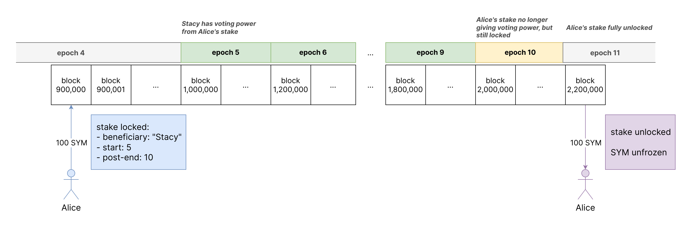
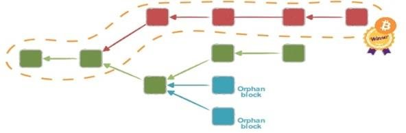

# Consensus

**Consensus** refers to the procedure Mel uses to produce and decide on a canonical blockchain history.

In broad strokes:

- Mel uses a _fixed-term proof of stake_ to decide consensus participants, known as **stakers**. Stakers must stake SYM, a special PoS token, for integer multiples of 200,000-block (~70-day) **epochs**, and changes in the effective list of stakers only happen on epoch boundaries.
- Each block is decided by a Byzantine fault-tolerant (BFT) consensus algorithm that eventually produces a **consensus proof** --- signatures from stakers owning at least 2/3 of the staked SYM. This produces _immediate finality_, meaning the block can never be reverted, and Mel can never have "block reorgs". Interestingly, the exact consensus algorithm used is not part of the core protocol rules and anything can be used as long as it produces consensus proofs of the right format; the current implementation, however, uses Streamlette, an extremely simple consensus derived from Streamlet.
- The **consensus game** --- the cryptoeconomic mechanism incentivizing consensus correctness --- generally trades off other properties (like capital efficiency) for robust long-term economic security. The "carrot" of a _collusion-tolerant fee economy_ allows stakers to extract value primarily through "benign collusion" on fees rather than block rewards or misbehavior. Strict **slashing**, including a catastrophic form known as "nuking", act as unusually powerful "sticks" against staker misbehavior.

## Staking and epochs

To select who gets to participate in consensus, Mel uses a proof-of-stake system. In short, anyone can lock up a sum of SYM, and while it is locked up, a designated node (the _staker_, which may or may not be the same person who locked up the SYM) receives voting power in consensus.

How does this work in practice? blockchain history is divided into 200,000-block epochs, conventionally numbered from 0. For example, block 12,345 is in epoch 0, while block 1,968,968 is in epoch 9. Anyone can stake (lock up) a particular SYM for a fixed number epochs, during which this SYM will give a designated staker voting power. This is done by sending a special transaction (of type `TxKind::Stake`, see TodoYellowPaper) with a SYM-denominated output, with the following metadata:

- the _beneficiary staker public key_ that uniquely identifies the staker who receives voting power
- the _starting epoch_ of this stake, or the first epoch in which this stake contributes to the staker's voting power
- the _post-end epoch of this stake_, or the epoch _after_ the last epoch that the stake contributes to the staker's voting power.

The SYM --- known as an individual **stake** --- is then locked up until the end of the the post-end epoch; after the start of the starting epoch and before the start of the post-end epoch, the staker has voting power.

To illustrate this, let's look at example. Here, Stacy is a staker node, and Alice is someone who staked 100 SYM at block height 900,000 for epochs 5..10, designating Stacy as the beneficiary:

<figure></figure>

This somewhat weirdly constrained staking system has two important consequences:

- Although stakes can be locked at any time, the _vote weights only change at epoch boundaries_. This turns out to be crucial for [mitigating "weak subjectivity" and enabling scalable and trustless light clients](light-clients.md).
- _Each stake is "inactive" for 1 epoch before unlocking_ --- epoch 10 in our illustrated example. This is important for economic security, as we will discuss shortly in the section on incentives.

## The BFT consensus itself

Given the list of consensus participants produced through proof-of-stake, a consensus protocol still needs to run to actually produce any blocks. The two important properties of Mel's consensus protocol, Synkletos, are its _immediate finality_ and _detached consensus proofs_.

### Immediate finality

Most blockchains use some form of "longest-chain" consensus, such as [Nakamoto consensus](https://decentralizedthoughts.github.io/2021-10-15-Nakamoto-Consensus/). There, anyone can grow the blockchain by building more blocks on existing blocks and broadcasting them, forming a continually growing "block tree". We then simply define the canonical blockchain as the "longest" or "heaviest" branch of this tree by some metric of long or heavy, and design incentives so that people build on what they see as the canonical chain --- this then leads to the canonical branch being overwhelmingly longer than the others.

<figure></figure>

Although elegant and highly resilient to temporary network faults, longest-chain consensus has a pretty big problem: lack of **finality**. You can never be sure that what you think is the canonical chain actually is the longest chain, since there _always could be a longer chain that you haven't discovered yet_, due to network lag, a malicious ISP, or other reasons. There's thus no objective, immutable blockchain history.

In practice, this problem mostly affects recent blocks, which often get "reorganized" when other recent branches turn out to be longer, and _most_ of the time waiting for a while (say for an hour) before trusting a block's content makes the chances of a subsequent reorganization past its height exceedingly unlikely. But the problem is that there's no way to define how long "a while" is --- especially when dealing with possibly malicious networks rather than simply lag.

This an especially bad problem for any apps that need to autonomously verify on-chain data from off-chain or other blockchains --- crucial to Mel's off-chain composable vision! All of these apps need to either handle the complex state rollback needed to deal with block reorganizations, or introduce large artificial latencies to wait for blocks to be old enough, which may or may not be long enough depending on factors (network latency and security) outside of the app's control.

Mel therefore does not use a longest-chain algorithm. Instead, we use an _immediately final_ BFT consensus. This means that once a block appears on the blockchain, it is permanently canonical and can _never be reverted_.

This solves all the finality problems related to off-chain composability, especially when combined with the next point --- off-chain verifiable proofs that a particular block is canonical.

### Detached consensus proofs

Every Mel block committed to history has a **consensus proof** --- signatures from stakers whose aggregate vote share for the epoch that the block belongs to exceeds 2/3 of the total vote share.

The interesting thing is that these proofs are _detached_ from the precise mechanism in which the BFT consensus works. The consensus algorithm does not need to produce the consensus proof: it may simply guarantee that all honest participants arrive at the same belief for each block. Each staker can then just "ask around" after the consensus produces a result, and given that the BFT consensus is correct, it's guaranteed that they will eventually gather a consensus proof and be able to broadcast the block to the wider Mel network.

In short, there's a three-step process for creating a block in Mel:

1. the stakers, among themselves, run a BFT to decide the block
2. an "asking around" gossip produces a consensus proof
3. the block, with a consensus proof attached, is broadcast throughout the Mel network and becomes part of history.

This means that nobody other than the stakers need to care about the precise way the BFT works. In particular, _changing the consensus algorithm doesn't need a governance upgrade to the blockchain validation rules_, which is important given [Mel's governance-free ethos](governance-free-neutrality.md) and the steady innovation seen in BFT consensus algorithms. For instance, through the history of the Mel betanet we started with a rough implementation of HotStuff, moved to the extremely simple and elegant Streamlet consensus, then to a different instantiation, ["Streamlette"](https://github.com/mel-project/streamlette), optimized for deciding one block in an immediate-finality setting.

Moreover, the simplicity of the consensus proof makes it really easy to verify by off-chain apps other than blockchain nodes. A light client that has the vote weights for the current epochs (which can be known [near-trustlessly](light-clients.md)) can easily verify a claim that a certain block is canonical, by simply checking the signatures in the consensus proof and adding the corresponding weights. This makes fully consensus-verifying light clients much easier to write than those for PoS algorithms with complex finalization rules (say, Ethereum), or even longest-chain proof-of-work blockchains.

## Consensus game

While staking decides _who_ gets to create blocks and the consensus algorithm _how_ they create blocks, the consensus game is the incentives behind _why_ anyone would create blocks.

The overall theme of Mel's consensus game is a overwhelming focus on maximizing economic security, especially long-term economic security. This because with governance delegitimized, we cannot really rely on "the community will fork away the bad guys" as a normal-case defense against consensus attacks (though, as we'll see, it's still used as a defense-in-depth for extreme cases). Upholding consensus security needs to be the profitable thing to do for stakers in a wide variety of circumstances.

Towards this end, we have a "carrot" and a "stick".

### Carrot: collusion-tolerant fee economy

Unlike most blockchains, Mel studiously avoids non-coordination assumptions in its consensus incentives. This means that it's _totally fine for rational stakers to collude_ and attempt to extract monopoly profits, or worse. Decentralization becomes more a matter of fault tolerance and ensuring that the average staker is economically rational, rather than trying to make collusion impossible, making the consensus oligopoly situations that often occur with both PoS and PoW much less scary.

The way Mel does this is a little surprising: we _give stakers all the tools they need to collude in a fee cartel_. In a system distantly inspired by EIP-1559, stakers vote on a uniform minimum fee level that all stakers must charge, in a system designed to simulate a "despotic" blockchain controlled entirely by a rational profit-maximizing monopoly --- who would turns out to actually behave in a trustworthy manner. This way, incentives to collude to extract more fees disappear, the equilibrium fee is the same no matter the level of collusion, and a whole lot of game-theoretical gnarliness surrounding pathological strategies in not-quite-collusion conditions (e.g. just a few dominant stakers) disappears.

Furthermore, our fee model turns to have the additional benefit of funding staker income almost entirely through fees rather than inflation, making staker income much more closely aligned with the interests of actual users of the blockchain rather than "SYM go up" or even "block reward go up".

### Stick: slashing and nuking

Like in other PoS systems, misbehaving stakers are punished by _slashing_ their stake. Anybody observing a staker misbehaving in a provable way (say, by signing two conflicting blocks for the same height) can submit a transaction that slashes their stake. This is also the reason for the mandatory "inactive epoch" before unstaking: to give a chance for slashing evidence to be submitted before the staker leaves.

Two important features separate Mel slashing from most other systems.

First, _slashing totally destroys the stake, redistributing it among other stakers_. Unlike blockchains like Ethereum that attempt to differentially penalize slashing based on how likely it is that it's part of coordinated attack, any slashing in Mel splits up the entire stake to the other stakers. Not only does this simplify the incentives and increase security, it gives an incentive for stakers to police each other, as they all stand to profit if a staker is slashed!

Second, there is _nuking_, an exceptional action similar but not quite like slashing, where more than 1/3 of the voting power has behaved maliciously. In this case, it is not possible to slash them on-chain anymore, since the malicious stakers can simply censor anybody who attempts to expose them.

Instead, _all nodes and clients are programmed to shut down_ if given proof of nuking. This makes attacking the network successfully without quickly shutting down the network extremely difficult even with the cooperation of all consensus participants, making the set of adversaries who would benefit from breaking consensus safety much smaller.

If even despite this threat nuking happens, a manual hard-fork recovery would indeed be necessary, but coordinating this would be much easier because people would be forced to recover the nuked network; there is simply no option to go along with the attack. Or in Vitalik's words, successful consensus attacks ["default to chaos" rather than "default to victory"](https://vitalik.ca/general/2020/08/17/philosophy.html).

## Summary

Mel's consensus is a combination of a fixed-term proof-of-stake, a Byzantine fault-tolerant consensus algorithm, and a collusion-tolerant fee economy with strict slashing and "nuking".

Proof-of-stake decides who gets to participate in consensus, and the consensus algorithm decides how blocks are created and provides immediate finality. The consensus game incentivizes stakers to create blocks reliably, with the "carrot" of a collusion-tolerant fee economy and the "stick" of strict slashing and nuking.

The combination of these three elements provides strong economic security against long-term consensus attacks, while also making light clients easy to write and blockchain upgrades easy to implement.
