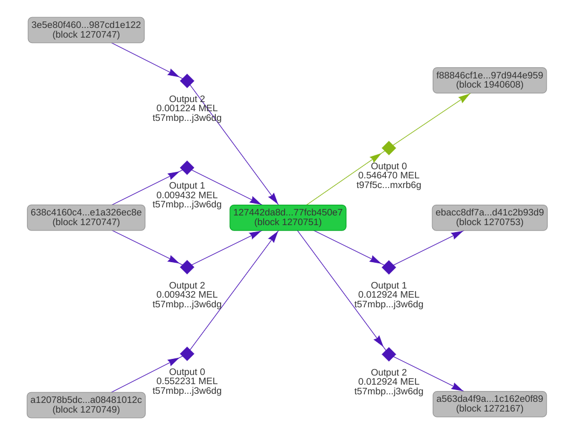

# Data model

A key way on-chain logic with "web3 superpowers" can be exported off-chain is through Mel's **data model**: how on-chain data and logic is organized. Mel uses a unique _coin-based_ (or UTXO-based) data model, a family including many of the earliest blockchains, like Bitcoin and Litecoin. We go into more detail into the differences in a [separate blogpost](https://medium.com/themelio/utxos-vs-accounts-54b3bbeb4428), but the main difference is that unlike account-based blockchains like Ethereum, Mel has no concept of "contracts" or "accounts".

<figure><figcaption>
Coin-based vs account-based models
</figcaption></figure>

Instead, the main abstraction that Mel presents is that of **coins**. The only kind of data on-chain is a "coin", also known as a transaction output (TXO). Each coin contains a sum of money (say, 100 MEL), as well as a **covenant**, or a program that runs to determine what transactions can spend this coin. Knowledge of how to satisfy the covenant of a coin (e.g. by producing a signature from the right public key) essentially maps to "ownership".

Transactions then reduce to atomic actions that remove (or "spend") and create coins, atomically. Since all coins are created by transactions, a coin can be uniquely identified by the transaction that created it plus an **output index** — which output of that transaction created it.

## An example of a transaction

A great way to understand how Mel's coin-based model works is to look at some transactions on Melscan. For example, consider [this rather boring money transfer](https://melscan.io/blocks/1270751/127442da8d5f7a20607e1ab99efb1e22717be852c1b56de02e8e5377fcb450e7).

<figure><figcaption></figcaption></figure>

As the picture above illustrates, the transaction spent 4 coins, all of which contain MEL, with the aggregate amount of 0.572319 MEL. They are all encumbered with the covenant with hash `t57...6dg` (which only allows transactions with a signature from a particular public key). These coins all have different coin IDs though, as they were created by different transactions.

The outputs of this transaction are more interesting: they must sum to the same amount of 0.572319 MEL (including the fees), but one of the outputs — the first one with value 0.546470 MEL — is locked by a different covenant, with hash `t97..b6g`, and colored green in the graphical visualization above.

Thus, the net result is that whoever can unlock coins with the `t57...6dg` covenant lost 0.546470 MEL, while the master of the `t97..b6g` covenant gained the same amount. And indeed, this is how a simple money transfer works in a coin-based model!

## Why coins?

At first sight, this seems pretty weird. Don't accounts, like those found on Ethereum, map much more nicely to usual intuitions about money transfers?

The first reason why Mel uses coins is that we _aren't_ trying to simulate a ledger of bank account balances. Instead, we want to encode _the consistency of a graph of interdependent events_. A huge class of security-critical problems boils down to establishing a consistent, valid event graph. For example, in a naming system, a successful name transfer also depends on a series of previous events: the previous owner relinquishing control, the new owner registering the name, and so forth. For a PKI, one CA issuing a valid certificate for a domain depends on the absence of conflicting histories of other CAs issuing other certificates for that same domain.

This essentially _forces a programming model suitable for off-chain composability_, where the core purpose of on-chain logic is to use coins and covenants to curate minimal globally-consistent data, while [app-embedded light clients](light-clients.md) query and manipulate this data to implement "superpowered" features.

Furthermore, coin-based transactions can generally be processed more efficiently than account-based transactions. Since transactions declare "up front" what blockchain state they manipulate, block validation can be done entirely in parallel, increasing the performance achievable given a certain level of node decentralization. Coins are also much easier to work with in **stateless clients** a technique that allows light clients to achieve complete equality in security with full nodes by paying a full node's bandwidth — but not storage — cost. (See the yellow paper TODO)

## The contents of coins

A full specification is found in the yellow paper (TODO), but from a high level a Mel coin contains the following:

- A **value**, like 100
- A **token denomination**, like MEL, SYM, or a custom token
- A **covenant hash**, referring to the covenant that locks this coin by hash
- Arbitrary **additional data**, usually used to pass arguments to covenants

An interesting fact is that we never embed covenants directly into coins, but only refer to them by hash. This is because the _spending_ transaction actually needs to supply the covenant — a technique borrowed from Bitcoin's ["pay by script hash"](https://en.bitcoin.it/wiki/Pay_to_script_hash) that avoids bloating the blockchain state with code before it is run.

## Querying coins

Finally, it should be noted that a really important feature for Mel's off-chain composable ecosystem is that _the coin graph can be trustlessly traversed by light clients_. In fact, the entire Melscan coin-graph explorer could be implemented without trusting a full node!

The details of how this works are described in the [article on light clients](light-clients.md).
