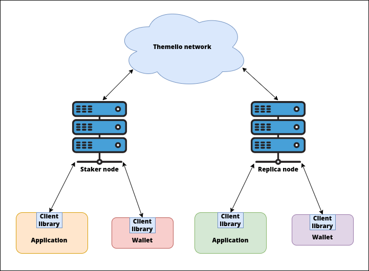

# Overview

Mel is currently in _beta mainnet_: there is a "[mainnet](https://scan.mel.org/)" with relatively stable and persistent history, but the staking tokens are not publicly available and the protocol is not quite production-ready.

Nevertheless, there is already a rich developer toolkit for interacting with the blockchain.

## Mel's architecture

Before diving into the specific tools, it's helpful to keep in mind the overall architecture of Mel.

<figure><figcaption>
Mel off-chain composable app ecosystem architecture
</figcaption></figure>

Participants in the Mel blockchain network itself can be roughly divided into (full) **nodes** and (thin) **clients**. Nodes replicate every block and transaction on the blockchain and help maintain network security. A subset of nodes, **staker nodes**, have `SYM` locked up and participate in the consensus to decide canonical blockchain history. All other nodes are **replica nodes** that replicate and verify blocks but do not propose new blocks.

Clients do not replicate any blocks, but are able to interact with the blockchain state by asking full nodes. An important design principle is that _clients do not trust full nodes_: full nodes must present proof that the info sent to the client is part of canonical blockchain history.

**Apps** are generally built _on top of_ Mel light clients. The most basic app is probably a **wallet**, a tool for managing on-chain assets and "manual" interaction with blockchain state. More complex applications can be built by composing on-chain logic with off-chain functionality using trust-minimizing light clients; this is the cornerstone of Mel's off-chain composability vision.

## Tooling overview

Currently, the following tools are available:

### Full nodes

Both staker and replica nodes are supported by **melnode**, our official node software. A basic guide is currently available.

Staking requires SYM, which is currently available only on the testnet. You can follow our testnet staking guide to learn how to run a staker node.

### light clients

We have a full-featured light client library available in **melprotocol**, our protocol crate. You can find detailed documentation on docs.rs.

Also available is an introductory guide to building your first trustless, off-chain app using a Mel light client.

### Wallets

We have an official, feature-complete CLI reference wallet called `melwallet-cli`.

There is also an alpha-quality GUI wallet, [Mellis](https://github.com/Mellabs/mellis), but features may be missing or broken.

### On-chain development

You can deploy on-chain logic using our high-level covenant programming language [Melodeon](https://melodeonlang.org/).

### Melminter

Help contribute information about the current price of computation to the network while earning Mel native tokens by running your own instance of [`melminter`](melmint/getting-tokens/using-melminter.md), a convenient CLI for minting ERG and converting to MEL.
