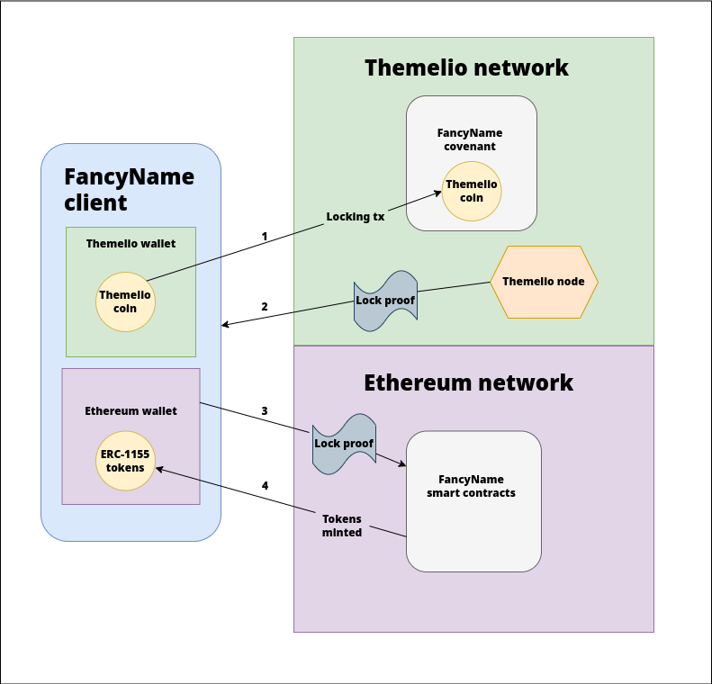
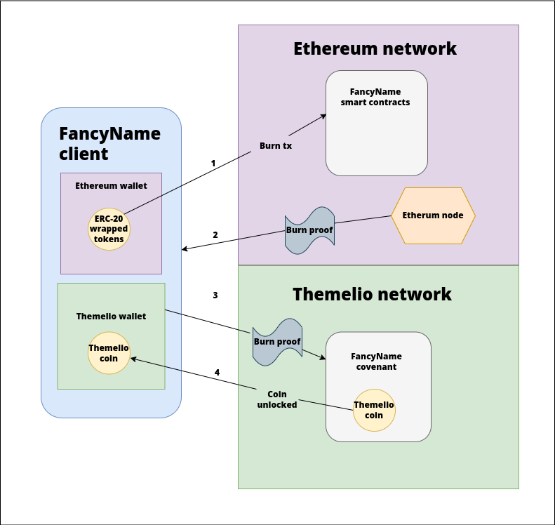

# Architectural overview

As we mentioned earlier, Szaldi is made up of two complementary components, a Mel covenant and a set of Ethereum smart contracts. Both of these components work together to enable the transfer of assets on Mel to Ethereum securely.

## From Mel to Ethereum

<figure><figcaption>
Diagram of the freeze and mint process.
</figcaption></figure>

Here we see that moving assets from Mel to Ethereum requires four steps:

1. Sending a transaction to the Szaldi covenant which essentially locks the transferred Mel coin.
2. Requesting the appropriate information from a Mel node in order to get proof of the locking transaction.
3. Submitting proof of the locking transaction to the Ethereum smart contracts to be processed.
4. After verification by the Ethereum smart contracts, your frozen coin will be minted as Ethereum tokens.

## From Ethereum back to Mel

<figure><figcaption>
Diagram of the burn and thaw process.
</figcaption></figure>

The process for moving your tokenized assets from Ethereum back to Mel is very similar:

1. Sending a transaction to the Szaldi smart contracts which burns the equivalent amount of tokens as the coin you are attempting to unlock.
2. Requesting the appropriate information from an Ethereum node in order to get proof of the token burn.
3. Sending the proof of burn to the Mel covenant to be processed.
4. After verification by the Mel covenant, your frozen coin will be unlocked and sent to your Mel wallet.

## Next steps

In this guide, we learned about the function and architecture of Szaldi and how it is powered by the native security of both Mel and Ethereum. In the next section we will learn how we can help strengthen the security of the Mel network ourselves by participating in staking.
